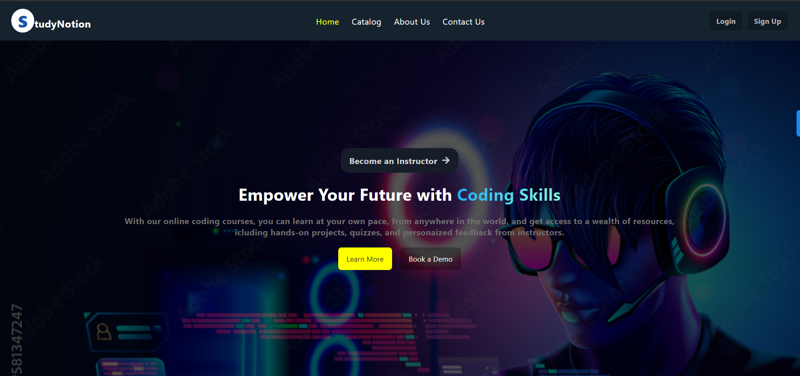
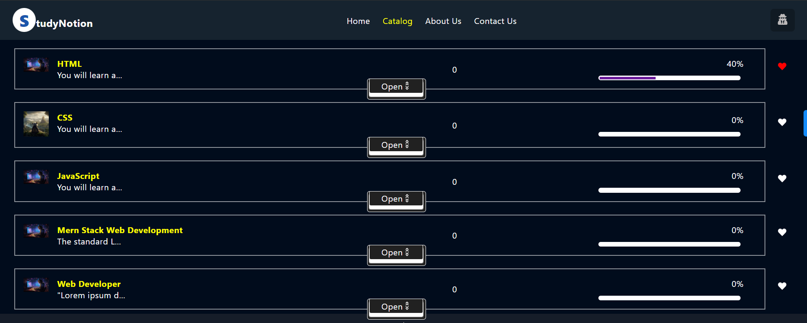
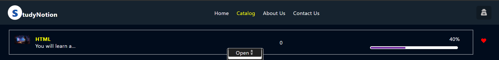
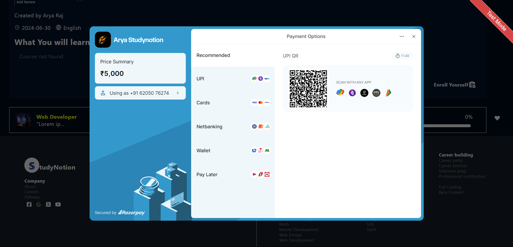
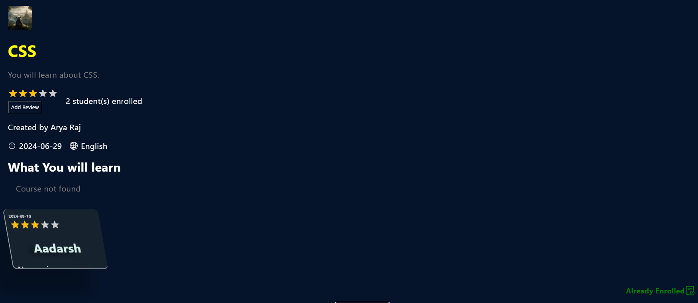
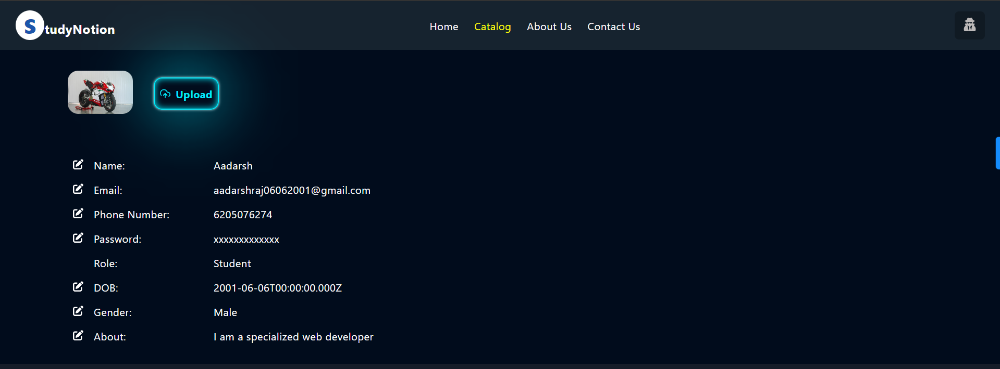
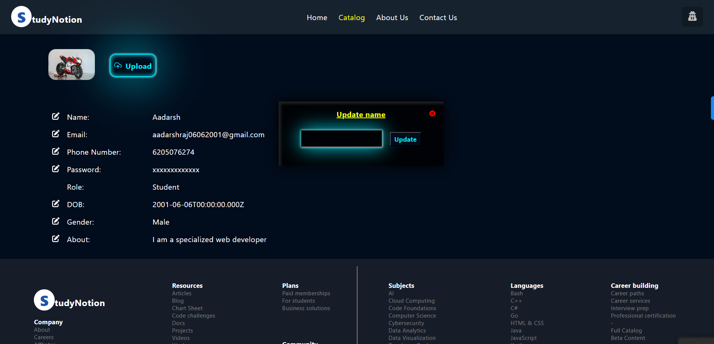

# Getting Started with Create React App

This project was bootstrapped with [Create React App](https://github.com/facebook/create-react-app).

# StudyNotion

StudyNotion is an educational technology project designed to facilitate learning and teaching online. It provides a comprehensive set of features for both students and instructors.

## Features

### For Students

- **Homepage 🏠**
  - Introduction to the platform with links to courses and user details.
  
  
- **Course List 📚**
  - View all available courses with descriptions and ratings.
  
- **Wishlist 💡**
  - Save courses of interest for future reference.
  
- **Cart Checkout 🛒**
  - Purchase courses securely.
  
- **Course Content 🎓**
  - Access course materials, including videos and documents.
  
- **User Details 👤**
  - View personal account information.
  
- **User Edit Details ✏️**
  - Update account information.

### For Instructors

- **Dashboard 📊**
  - Overview of courses, ratings, and feedback.
  
- **Insights 📈**
  - Detailed metrics on course performance.
  
- **Course Management Pages 🛠️**
  - Create, update, and delete courses.
  
- **View and Edit Profile Details 👀**
  - Manage personal account information.

## Back-end

StudyNotion's back-end is built on Node.js and Express.js, providing robust APIs for the front-end to consume. It supports user authentication, course management, payment integration, and media handling via Cloudinary.

### Features

- **User Authentication and Authorization 🔐**
  - Sign up, log in, OTP verification, and password recovery.
  
- **Course Management 🛠️**
  - CRUD operations for courses and media.
  
- **Payment Integration 💳**
  - Seamless checkout with Razorpay integration.
  
- **Cloud-based Media Management ☁️**
  - Store and manage media content using Cloudinary.
  
- **Markdown Formatting ✍️**
  - Render course content stored in Markdown format.

### Data Models and Database Schema

- **Student Schema 🧑‍🎓**
  - Name, email, password, enrolled courses.
  
- **Instructor Schema 👩‍🏫**
  - Name, email, password, managed courses.
  
- **Course Schema 📚**
  - Name, description, instructor, media content.

### Database

StudyNotion uses MongoDB, a flexible NoSQL database, to store course content, user data, and platform information.

